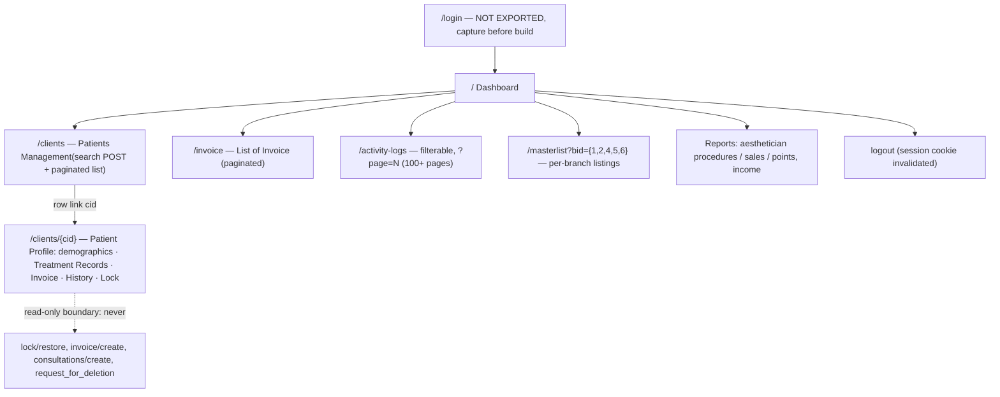

# CRM Discovery — Architecture

> **Design document (Sprint 2B.1, ADR-027; mock connector shipped 3.4).**
> Grounded in real evidence: the **authoritative CRM reference set at
> `docs/crm-reference/`** (HTML exports, invoice detail photos, owner notes —
> gitignored: it contains real patient/staff PII and stays local-only). The CRM is an
> external legacy system: it will not be modified; integrations adapt to it. Consult
> the reference folder before writing any CRM-related code; when its behavior is
> unclear, ask — never assume. All example values in this document are fictional.
> Related: [ARCHITECTURE.md](ARCHITECTURE.md) §11 · [DOMAIN_MODEL.md](DOMAIN_MODEL.md) ·
> [OCR_ARCHITECTURE.md](OCR_ARCHITECTURE.md) · [AI_RULES.md](AI_RULES.md)

**Mission:** retrieve authoritative business facts from the CRM — patient, treatment
records, invoices, activity log — and normalize them into one internal model. The rest
of the platform depends only on that model through the `CRMConnector` seam; **no code
outside `services/crm/` ever knows a CRM page, URL, selector, or field name exists.**

## 1. What the CRM actually is (from the exports)

A server-rendered, session-cookie web application (CSRF `_token` on every form, no
JSON API surfaced in pages, classic pagination). Key observed facts that shape this
design:

| Observation                                                                                                                                                                                                                                                                                                                   | Design consequence                                                                                                                                                                                                                             |
| ----------------------------------------------------------------------------------------------------------------------------------------------------------------------------------------------------------------------------------------------------------------------------------------------------------------------------- | ---------------------------------------------------------------------------------------------------------------------------------------------------------------------------------------------------------------------------------------------- |
| Patient search is a rich POST form (`client_id`, `first_name`/`last_name`/`middle_name`, `dob`, `email`, `mobile_no`, `nickname`, …) — **corrected M0041:** that rich POST form is the _Register client_ modal; the actual search is a **GET filter** with `search` (name), `search_mobile`, and a last-visit date range only | Server-side lookup = name/mobile/last-visit; `cid` resolves by direct profile navigation; email refines client-side; **dob is not live-searchable** (connector returns `not-found` for dob-only queries — documented divergence from the mock) |
| Patient list columns: NAME, EMAIL, MOBILE, TYPE, LAST VISIT, CREATED AT; rows link to `/clients/{cid}`                                                                                                                                                                                                                        | `cid` is the CRM's stable patient key — capture it once, reuse it forever                                                                                                                                                                      |
| Patient profile carries **Treatment Records** tables: DATE, BRANCH, PROMO CODE, PROCEDURE, INTENSITY SETTINGS, USER — grouped per availed service/package (e.g. "GLUTA DRIP 10 SESSION")                                                                                                                                      | The treatment record is session-granular and package-scoped; USER is the person who performed/encoded (§3 open question)                                                                                                                       |
| Invoice list: REF NO, CLIENT NAME, CONTACT NO., SERVICE NAME, AMOUNT, AMOUNT PAID, BALANCE, DATE UPDATED, STATUS (`Paid` observed); per-payment: Mode of Payment, Received By, Payment Reference No                                                                                                                           | Invoices are per-service with running balances; payments are separate sub-records                                                                                                                                                              |
| Activity Logs: Log Name, Description, Caused By, Date, Details / **Old Details** (field-level diffs: `service.name`, `amount_paid`, `branch_id`, `status`, `deleted_at`, `synced_at`), filterable, 100+ pages                                                                                                                 | The CRM keeps an edit history — discovery can detect after-the-fact edits and deletions, which is audit gold; but full-log scraping is impractical → filter by patient/date                                                                    |
| Branch masterlists `?bid=1,2,4,5,6`; branch names appear in data ("Fermosa Tejero", "Fermosa Imus", "Fermosa - Manggahan", "Fermosa - Indang")                                                                                                                                                                                | CRM branch ids must map to platform `Branch` rows (config table, §4)                                                                                                                                                                           |
| Records can be locked/restored (`/clients/lock-treatment-records/{cid}`) and deletion is request-based (`/invoice?request_for_deletion=true`)                                                                                                                                                                                 | Read-only discovery must never touch these — the connector is **read-only by contract**                                                                                                                                                        |

### Additional facts from the reference set (2026-07-13 study of `docs/crm-reference/`)

| Fact                                                                                                                                                                                                                                                                                                                                                                                                | Consequence                                                                                                                                                                                                                                                                                                                                                                        |
| --------------------------------------------------------------------------------------------------------------------------------------------------------------------------------------------------------------------------------------------------------------------------------------------------------------------------------------------------------------------------------------------------- | ---------------------------------------------------------------------------------------------------------------------------------------------------------------------------------------------------------------------------------------------------------------------------------------------------------------------------------------------------------------------------------- |
| **Logins are branch-level accounts** ("Fermosa - Trece"), username + password; receptionists operate them (owner notes)                                                                                                                                                                                                                                                                             | The CRM's "Caused By" attributes actions to a _branch_, not a person. A dedicated read-only audit account fits this model naturally; §5's service-account design stands                                                                                                                                                                                                            |
| **Receptionists tag Aesthetician, IV Therapist, and Salesperson** on records; report filters expose `performed_by`, `received_by_id`, and `completed_by` as distinct staff attributions                                                                                                                                                                                                             | Largely resolves the §3 USER-column question: treatments carry a _performer_ (aesthetician/IV therapist), payments carry a _receiver_ (salesperson/front desk), and records a _completer_ (encoder). The normalized `performedBy.role` enum will need `iv-therapist` and `salesperson` — contract is frozen post-3.4, so this lands with a short ADR alongside the matching sprint |
| **Patient IDs are not written in logbooks today**; the CRM developer will add them later (owner notes)                                                                                                                                                                                                                                                                                              | Initial matching is name-based (`ambiguous` is a main path); when logbooks gain patient IDs, OCR gains a field and lookup becomes exact — design for that upgrade, don't wait for it                                                                                                                                                                                               |
| **Invoices are generated after treatment encoding** (owner notes)                                                                                                                                                                                                                                                                                                                                   | Sequence semantics for matching: treatment-without-invoice = encoded but never invoiced; invoice-without-treatment is the reverse anomaly                                                                                                                                                                                                                                          |
| **Invoice detail anatomy** (photo samples): header `ref · patient · mobile · service`, ref format like `007-162320` with per-payment refs `162320-001…`; SERVICES (service/description), line items (QTY/PRICE/TOTAL), PAYMENTS (date, ref, amount, method, service, remarks, **RECEIVED BY as `staffId staffName`**, e.g. "102 …"); status literal `PARTIALLY PAID`; per-payment Edit/Delete links | Closes the invoice-detail evidence gap. Normalization maps status literals (`PARTIALLY PAID` → `partial`); `receivedBy` can be split into id + name; payments are installments — sessions and payments are NOT 1:1                                                                                                                                                                 |
| **Real `branch_id` list** from report filters: Trece Martires=1, Tejero=26, Imus=28, Unitop=34, Tagaytay=36, Silang=37, Molino=38, Noveleta=40, **Training=47**, Manggahan=49, Naic=50, … (20+ branches)                                                                                                                                                                                            | The §4 branch mapping table keys on `branch_id`. Note: the sidebar's `masterlist?bid=1,2,4,5,6` uses a _different, smaller_ id space — bid ≠ branch_id (open question below). "Training" must be excluded from audit scope                                                                                                                                                         |
| Staff selector on reports has **hundreds of users**                                                                                                                                                                                                                                                                                                                                                 | Staff mapping tables should be lazy/on-demand, never a full sync                                                                                                                                                                                                                                                                                                                   |

**Evidence gaps / open questions** (ask, don't assume): the login page itself (auth
model known — branch account + username/password — but selectors/CSRF flow uncaptured),
the patient-profile "History" tab contents, a multi-result search response, and the
meaning of `masterlist?bid=` ids versus report `branch_id`s.

## 2. Discovery Pipeline

```
AuditSubmission (CRM_COMPARISON stage)
        │  input: CONFIRMED OCR data only (OCR_ARCHITECTURE §1) —
        │  entries: patientName, treatment, therapist, time (+ auditDate, branch)
        ▼
┌─ CRM DISCOVERY (CRMConnector seam) ──────────────────────────────────────┐
│                                                                          │
│  per distinct patient in the confirmed entries:                          │
│                                                                          │
│   1. PATIENT LOOKUP        search by name (+dob/mobile when OCR review   │
│                            captured them) → resolve to CRM `cid`         │
│                            outcomes: found | not-found | ambiguous (§6)  │
│   2. TREATMENT RETRIEVAL   profile → Treatment Records, filtered to the  │
│                            audit date ± configurable window              │
│   3. INVOICE RETRIEVAL     invoices for the cid / service on that date   │
│   4. ACTIVITY RETRIEVAL    activity log filtered to the patient/records  │
│                            (edit & deletion detection — never full scan) │
│   5. NORMALIZE             page/API shapes → NormalizedCrmPatientRecord  │
│   6. SNAPSHOT + PERSIST    store normalized record + raw source capture, │
│                            stamped retrievedAt + connectorKind           │
│                                                                          │
└──────────────────────────────┬───────────────────────────────────────────┘
                               ▼
        CrmComparison rows (DOMAIN_MODEL §3) — reproducible snapshots
                               ▼
        MATCHING ENGINE (Sprint 4): logbook entries × CRM facts
```

Principles: discovery is **read-only** (GET + search POSTs only; never a mutating
route); it consumes **confirmed** OCR data, never raw extractions; every retrieval is
**snapshotted** so comparisons stay reproducible after the CRM changes (the
`CrmComparison.records` JSON already reserved in DOMAIN_MODEL §3); and it is
**resumable per patient** — one failed lookup doesn't discard nine successful ones.

## 3. Normalized CRM Model

One provider-independent object per patient per discovery run. This is the ONLY shape
the matching engine, review UIs, and reports ever see:

```ts
NormalizedCrmPatientRecord {
  // provenance — every consumer can ask "when and how was this true?"
  retrievedAt: ISO timestamp
  connectorKind: "browser-automation" | "api" | "mock"
  sourceRef: string            // connector-internal (page URL set / API cursor)

  patient: {
    crmId: string              // the /clients/{cid} key — the durable identity
    fullName: string
    firstName / middleName / lastName / nickname: string | null
    dateOfBirth: ISO date | null
    email / mobileNo: string | null      // PII: encrypted at rest, masked in UI
    membershipType: string | null        // list "TYPE" column
    lastVisit: ISO date | null
  }

  treatments: Array<{
    performedAt: ISO date                // profile DATE
    branch: { crmBranchId, name, platformBranchId | null }   // mapped via §4 table
    procedure: string                    // PROCEDURE — matching key vs logbook "treatment"
    packageName: string | null           // owning availed service, e.g. "GLUTA DRIP 10 SESSION"
    sessionNumber / sessionsTotal: number | null
    promoCode: string | null
    intensitySettings: string | null     // verbatim; clinical detail, not matched in v1
    performedBy: { name, role: "aesthetician" | "encoder" | "unknown" }  // USER column — see open question
    locked: boolean                      // lock-treatment-records state if visible
  }>

  invoices: Array<{
    refNo: string                        // REF NO — durable invoice identity
    serviceName: string
    amount / amountPaid / balance: decimal (money as string, currency PHP)
    status: string                       // normalized lowercase: "paid" | "partial" | …
    dateUpdated: ISO date
    payments: Array<{ paidAt, amount, mode, receivedBy, referenceNo }> | null
  }>

  activity: Array<{                      // filtered to this patient / audit window
    occurredAt: ISO timestamp
    logName: string                      // e.g. "created", "updated", "deleted"
    description: string
    causedBy: string                     // CRM user — edit accountability
    changes: Array<{ field, oldValue, newValue }> | null   // Details/Old Details diffs
  }>
}
```

Why the load-bearing choices: **crmId over names** — the exports show name collisions,
prefixes like `**`, and "(double Encode)" entries; names are search inputs, `cid` is
identity. **Money as decimal strings** — floats corrupt balances. **`performedBy` with
a role enum** — the profile's USER column may be the aesthetician _or_ the encoder;
matching against the logbook's "therapist" needs to know which. **Marked open
question** to resolve with clinic staff before implementation. **Activity diffs
normalized to field/old/new** — this is how the matching engine flags "this record was
edited after the audit date" as its own finding class. **Everything nullable that the
CRM leaves blank** — the exports show plenty of sparse fields; absence must be
representable without sentinel strings.

## 4. CRM Navigation Map (browser-automation implementation)

Observed routes (server-rendered; each page also carries the global sidebar):



Discovery uses exactly four page families: **Patient Search** (`/clients` POST with
`_token`), **Patient Profile** (`/clients/{cid}` — treatments, embedded invoices,
history), **Invoice list** (`/invoice`, filtered), **Activity Logs**
(`/activity-logs` + filters). Dashboard/reports/masterlist are out of scope for v1
retrieval (reports may later serve reconciliation cross-checks).

> **Performance (M0058, live 2026-07-15):** the activity-log **filtered** query
> is slow server-side — ~15 s for a keyword + date-range window — so a full
> **windowed** `fetchPatientRecord` runs ~18 s+. The filter submit's click is
> given a navigation-sized timeout (the 10 s action default was too short and
> caused a spurious failure). Windowed/scheduled audits must budget for this.

## 5. Browser Automation Strategy (real connector shipped in M0041; live runs gated)

> _Status (M0041, ADR-033): the full stack now exists — `PlaywrightBrowserDriver`
> (Chromium, the only Playwright import site), selector map v1 rebuilt from the
> reference captures with per-table column-header fingerprints and per-page
> `neverInteract` lists, seven page objects, `BrowserSessionManager` (one login per
> execution, idle re-verification, one-reconnect recovery), and
> `PlaywrightCRMConnector` under the `browser-automation` kind
> (`CRM_CONNECTOR=playwright` alias; credentials via `CRM_URL`/`CRM_USERNAME`/
> `CRM_PASSWORD`). Still gated before live runs: the sanctioned service account (§8),
> a login-page capture (its v1 selectors are provisional), and the invoice-detail
> trigger (payments stay `null` behind the `invoiceDetail` capability flag until
> confirmed)._
>
> _Status update (M0042, ADR-034): live validation was attempted and remains
> **blocked** — no credentials exist in `.env`; the selector map is still v1,
> untouched, because nothing live was observed to correct against. `/dev/browser` is
> now the supervised validation cockpit (credential badges, connector health, patient
> search, open patient, normalized-JSON preview through `getCRMConnector()`), so the
> M0041 checklist becomes a button-clicking session the day credentials land. What the
> CRM record feeds once retrieved: M0043's `AuditEvidenceSnapshot` (hash-sealed,
> append-only audit evidence — ADR-035)._
>
> _Status update (M0042A, ADR-036): the selector map WAS then validated against real
> captures — login (the §8 blind spot, now closed: `input[name=email]` + password in
> a Laravel CSRF POST form, NO captcha), fresh dashboard + patients saves, and the
> CRM's own `announcements.js`. A capture-replay harness
> (`docs/crm-reference/verify-captures.mts`) executes the real page objects against
> the captured DOM in real Chromium: 27/27 pass. v1 was patched in place
> (non-breaking). Three live-behavior facts every future page object must respect:
> (1) the **announcement modals** (`#instant-announcement-modal`,
> `#announcement-checklist-modal`) are re-polled every 5s on every authenticated page
> and their close buttons POST mark-as-read — automation neutralizes the nodes
> client-side and never clicks them; (2) tables can ship **CSS-hidden until page JS
> initializes** them — fingerprints must wait, not probe; (3) **select2** replaces
> filter selects and hides the native element permanently — plain inputs only in
> fingerprints. Still unverified: the invoice tab's post-AJAX DOM and the invoice
> DETAIL view (capability off)._
>
> _Status update (M0049–M0055): validated against production and hardened — see
> `docs/MILESTONES/M0049.md`. The connector logs in, searches (found/not-found/
> ambiguous), retrieves schema-valid records across all page families, and logs out;
> four live-only defects were fixed._
>
> _Status update (M0056, ADR-039): **invoice detail + payments are now LIVE and the
> connector is production-ready.** The invoice DETAIL is **not a separate page** — the
> CRM embeds it per invoice row as a **base64 JSON `data-details` attribute** on the
> `<tr>`, carrying a `payments` array (amount, `date_paid`, `prn` reference,
> `payment_type`, `received_by` = "badge# Name", remarks, `deleted_at`/
> `request_for_deletion`) and an `items` services array. Reading it is **READ-ONLY** —
> the data is already in the list DOM; the connector never clicks the `data-clickable`
> cells or navigates. `invoiceDetail` is **enabled** (still v1, additive). Live run:
> 10 invoices → 15 payments parsed, 41 ms, 0 non-completed. **USER semantics (verified,
> not guessed):** in the DATA THE CONNECTOR RETRIEVES, staff appear only as a
> "badge# Name" string (treatment USER column, invoice/payment `received_by`), with a
> separate numeric `*_id`; **no role label is present in any retrieved record**. So
> receptionist / aesthetician / IV-therapist / salesperson cannot be distinguished from
> the audit read path (that lives in the CRM's staff directory / report filters, not in
> the records) — `performedBy.role` stays **`"unknown"`**, which is correct, not a gap.
> Per-payment `status` (completed / cancellation-requested / cancelled) is the one new
> field, additive + optional (ADR-039). Timings: login ~7.7s cold, search ~1.9s,
> profile+tabs ~2.4s, full record ~15.7s (≈5.6s on session reuse), logout ~6.8s._

The first `CRMConnector` implementation drives a real browser. Design decisions:

- **Page objects behind the connector**: each page family gets one module owning its
  selectors and parsing (`patient-search.page.ts`, `patient-profile.page.ts`, …).
  Selectors live in **one versioned selector map** per page — the CRM has no
  versioned markup, so our selector map version is recorded on every snapshot
  (`sourceRef`), mirroring OCR's prompt versioning.
- **Session lifecycle**: one authenticated browser context per discovery run, reused
  across patients within the run; never one login per lookup (politeness + activity-log
  noise), never a shared global session across concurrent runs. Cookies are held in
  memory only — never persisted to disk.
- **Authentication**: a dedicated read-only CRM service account (to request from CRM
  admins — its actions are attributed in the CRM's own activity log as "Caused By",
  so a recognizable name like `fermosa-audit-bot` is a feature). Credentials via
  validated env (`lib/config/env.ts`), never in code or repo. Login flow performs the
  CSRF `_token` dance like any form; the login page must be captured first (§1 gap).
- **Session expiration**: every navigation asserts an "am I still authenticated?"
  invariant (presence of the sidebar/user chrome vs. redirect to login). On expiry:
  re-authenticate once, resume the current step; a second expiry in the same run
  aborts with `CRM_SESSION` error.
- **Timeouts**: per-navigation timeout (default 30 s) and per-patient budget
  (default 3 min) and per-run budget — all in config. Budget exhaustion = partial
  result with explicit per-patient statuses, never a hung job.
- **Retry policy**: navigation/selector failures retry ×2 with backoff **after a
  fresh page load** (server-rendered pages are cheap to reload); parse failures do
  not retry (same HTML → same failure) — they snapshot the HTML and fail as
  `CRM_LAYOUT`. Politeness: sequential navigation per session, small jittered delay
  between page loads; discovery must be indistinguishable from a careful human clerk.
- **Unexpected page handling**: any page that matches neither the expected page
  object nor the login page → capture screenshot + HTML to diagnostics storage
  (`StorageProvider`, PII-scoped retention), fail the step as `CRM_LAYOUT`. The
  announcement modal seen in exports ("I have read the announcement…") is the known
  interstitial — page objects dismiss it explicitly.
- **CAPTCHA (future)**: not observed in exports. If one ever appears, the run fails
  as `CRM_CHALLENGE` and surfaces for human action — **never automated bypass**; the
  durable fix is the API strategy (§7) or an admin-side allowlist for the service
  account.
- **Layout drift detection**: page objects validate structural fingerprints (expected
  column headers, e.g. Invoice's `REF NO … STATUS`) before parsing; a header mismatch
  is `CRM_LAYOUT` with the diff in the error detail — so a CRM redesign is detected
  loudly on the first run, not as silently wrong data.

## 6. Error Model

All failures surface as typed `AppError`s from the connector; discovery records a
per-patient outcome so the run is resumable and the reviewer sees exactly what
happened. Business outcomes are **not** exceptions:

| Case                                          | Kind                                                          | Handling                                                                                                               |
| --------------------------------------------- | ------------------------------------------------------------- | ---------------------------------------------------------------------------------------------------------------------- |
| Patient not found                             | outcome `not-found`                                           | A finding for matching ("logbook entry has no CRM patient"), not an error; recorded with the queries attempted         |
| Multiple matches                              | outcome `ambiguous` (candidates list: cid, name, dob, mobile) | Never auto-pick. Surfaces in review UI for human disambiguation; the choice is remembered for the submission           |
| Treatment missing on audit date               | outcome `no-treatments` (empty `treatments` window)           | Exactly what the matching engine exists to flag — normal data                                                          |
| Invoice missing                               | empty `invoices` + flag                                       | Normal data; matching decides severity                                                                                 |
| CRM unavailable (down/unreachable/5xx)        | error `CRM_UNAVAILABLE`                                       | Retry per §5; then park the comparison stage (submission stays recoverable, DOMAIN_MODEL §5.1) with a scheduled re-run |
| Permission denied (account lacks page access) | error `CRM_FORBIDDEN`                                         | No retry — configuration problem; alert operator, name the page                                                        |
| Unexpected layout                             | error `CRM_LAYOUT`                                            | Snapshot HTML+screenshot, no parse-retry; alert — selector map likely needs a new version                              |
| Session expired mid-run                       | error `CRM_SESSION` (after one re-auth attempt)               | §5 lifecycle                                                                                                           |

## 7. API Strategy (future)

The existing `CRMConnector` Strategy seam (ADR-016) is already shaped for this: the
interface speaks **§3's normalized model and §6's outcomes only** — nothing about
pages, sessions, or HTTP. The contract 2B.1 hands to Sprint 3 (refined pre-freeze,
per ADR-015):

```
CRMConnector
├─ healthCheck(): reachable + authenticated + (browser: selector fingerprints OK)
├─ findPatients(query: { name?, firstName?, lastName?, dob?, mobileNo?, email?, crmId? })
│    → { outcome: "found" | "not-found" | "ambiguous", candidates: PatientSummary[] }
└─ fetchPatientRecord(crmId, window: { from, to })
     → NormalizedCrmPatientRecord            // treatments/invoices/activity in window
```

When the CRM exposes an API: implement `api` connector kind against the same three
methods, map API JSON → §3 in that adapter, flip `CRM_CONNECTOR=api`. Callers,
matching, snapshots, and review UIs change **zero lines** — that is the acceptance
test for this design. The `mock` connector (fixtures modeled on the exports, PII-free)
ships first and is what Sprint 4's matching engine develops against — matching does
not wait for browser automation.

## 8. Risks Before LIVE Operation (implementation shipped in M0041)

1. **Login page unexported** — auth flow (fields, CSRF, possible 2FA/captcha) is the
   one part of the map we haven't seen. The v1 login selectors are conservative
   provisional guesses with a minimal fingerprint (they fail loudly, never submit
   blindly); capture the page (plus an invoice detail view and a multi-match search)
   before unattended runs. **Gating input.**
2. **USER-column semantics** (§3): aesthetician vs. encoder determines how logbook
   "therapist" matches — one question to clinic staff resolves it.
3. **Service-account approval**: a dedicated read-only CRM login needs owner sign-off;
   using a human's account would poison the CRM's own audit trail and violate
   least-privilege.
4. **Data quality in the CRM**: exports show duplicate/annotated names (`**`,
   "(double Encode)") — patient lookup must expect noise; the `ambiguous` path is not
   an edge case, it's a main path.
5. **Legal/PII**: CRM exports and future snapshots contain patient PII. Exports stay
   out of the repo; snapshots live in access-controlled storage with the same
   branch-scoping as submissions; contact fields are masked in UIs by default.
6. **CRM changes without notice** (no versioning, no staging environment we know of):
   selector-map versioning + fingerprint checks (§5) make drift loud; budget for
   selector maintenance as recurring work, not incident response.
7. **Politeness/ToS**: scraping our own production CRM still deserves rate limits and
   owner awareness — get explicit sign-off that automated read access is sanctioned.
