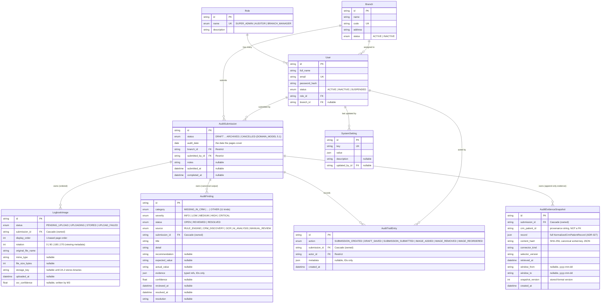

# Database

PostgreSQL, managed through Prisma. Schema: [`prisma/schema.prisma`](../prisma/schema.prisma).
The business meaning of the audit entities is defined in [DOMAIN_MODEL.md](DOMAIN_MODEL.md) —
this file covers the physical model only.

## Entity-Relationship Diagram



All tables additionally carry `created_at` / `updated_at` (append-only tables —
`audit_trail_entries`, `audit_evidence_snapshots` — carry only `created_at`).

Future tables — `ocr_results`, `crm_comparisons`, `audit_reports` — are fully specified
in [DOMAIN_MODEL.md §3](DOMAIN_MODEL.md#3-entities) and are created when their milestone
ships (ADR-019: no speculative tables).

## Modeling Notes

- **IDs** are cuids (string PKs) — safe to expose in URLs, no enumeration risk.
- **`AuditSubmission` is the aggregate root** (ADR-023): `LogbookImage` rows are reached
  and mutated only through their submission. `onDelete: Cascade` on the image FK
  expresses true ownership; `onDelete: Restrict` on the submission's branch/user FKs
  protects the audit trail (ADR-010) — deactivate people and branches via `status`,
  never delete.
- **`audit_date` is a `DATE`**, not a timestamp: it names the calendar day the logbook
  pages cover, independent of when anyone uploaded them.
- **No unique constraint on `(branch_id, audit_date)`** — follow-up submissions for the
  same date are a legitimate business case (DOMAIN_MODEL.md §8, risk 2).
- **`display_order` has an index but no unique constraint**: reorder operations swap
  values transiently; contiguity (1..n) is a service-layer invariant.
- **`rotation` is viewing metadata** — the stored binary is never modified.
- **`storage_key` is nullable** and stores an object-storage key (S3/Azure Blob), never
  the binary — files don't belong in Postgres. Null until Sprint 2A.2 implements storage.
- **`User.branchId` is nullable**: Super Admins and Auditors are organization-wide;
  Branch Managers get an assigned branch. Enforced at the application layer.
- **`SystemSetting.value` is `Json`** so one table serves booleans, numbers, and
  structured config without migrations per setting.
- **`audit_evidence_snapshots` is append-only evidence, not a CRM mirror** (M0043,
  ADR-035): `crm_patient_id` is deliberately not a foreign key — no patient master
  table exists. The `record` jsonb is sealed by `content_hash` (canonical sorted-key
  SHA-256, because jsonb does not preserve key order) and re-verified on every load.
- **Naming**: tables and columns use `snake_case` via `@@map`/`@map`; Prisma models stay
  `camelCase`.

## Workflow

```bash
pnpm db:migrate    # create + apply a migration after editing schema.prisma (dev)
pnpm db:deploy     # apply pending migrations (CI/production)
pnpm db:seed       # idempotent seed (roles, branches, demo users, settings)
pnpm db:studio     # inspect data
```

- **`AuditTrailEntry` is append-only** (Sprint 2A.2): rows are never updated or deleted
  independently of their submission; `metadata` carries IDs and filenames, never blobs.

Applied migrations: `20260712221833_initial_schema`,
`20260712231752_audit_submission_domain_model` (replaced the M1 `AuditSession` /
`LogbookUpload` tables — both empty — with the ADR-023 model),
`20260713033923_audit_trail_entries` (Sprint 2A.2 audit trail),
`20260713163129_audit_findings` (Sprint 3.5 canonical findings, ADR-028 — rows are
never hard-deleted; false positives resolve with a note).
