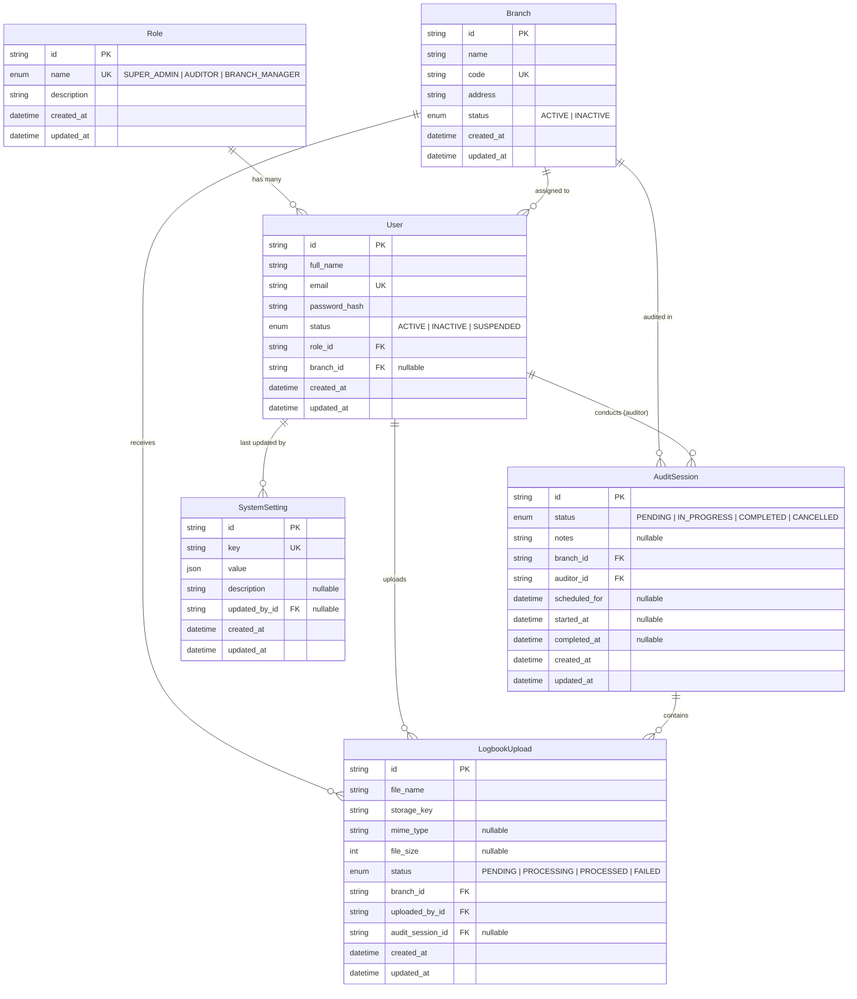

# Database

PostgreSQL, managed through Prisma. Schema: [`prisma/schema.prisma`](../prisma/schema.prisma).

## Entity-Relationship Diagram



## Modeling Notes

- **IDs** are cuids (string PKs) — safe to expose in URLs, no enumeration risk.
- **`User.branchId` is nullable**: Super Admins and Auditors are organization-wide;
  Branch Managers get an assigned branch. Enforced at the application layer.
- **`LogbookUpload.auditSessionId` is nullable**: logbooks can be uploaded ahead of an
  audit session and attached later (Milestone 2 decides the exact flow).
- **`LogbookUpload.storageKey`** stores an object-storage key (S3/Azure Blob), never the
  binary — files don't belong in Postgres.
- **`SystemSetting.value` is `Json`** so one table serves booleans, numbers, and structured
  config without migrations per setting.
- **Delete behavior**: users cannot be hard-deleted while they own audit sessions/uploads
  (`onDelete: Restrict`) — audit trails must survive. Branch deletion cascades its sessions
  and uploads; deactivate branches (status) instead of deleting them in practice.
- **Naming**: tables and columns use `snake_case` via `@@map`/`@map`; Prisma models stay
  `camelCase`.

## Workflow

```bash
pnpm db:migrate    # create + apply a migration after editing schema.prisma (dev)
pnpm db:deploy     # apply pending migrations (CI/production)
pnpm db:seed       # idempotent seed (roles, branches, demo users, settings)
pnpm db:studio     # inspect data
```
