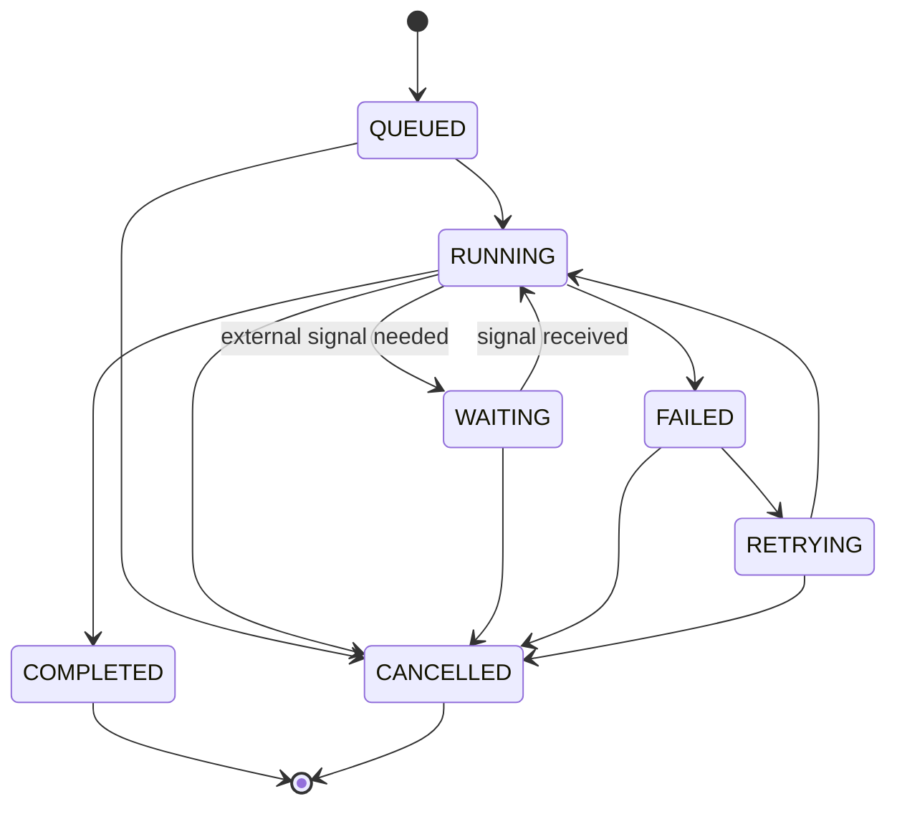
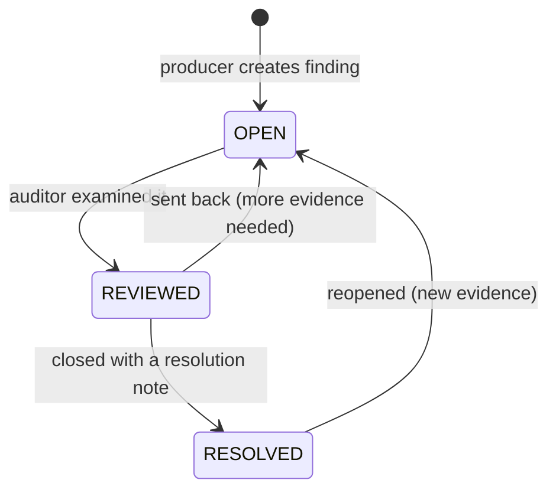
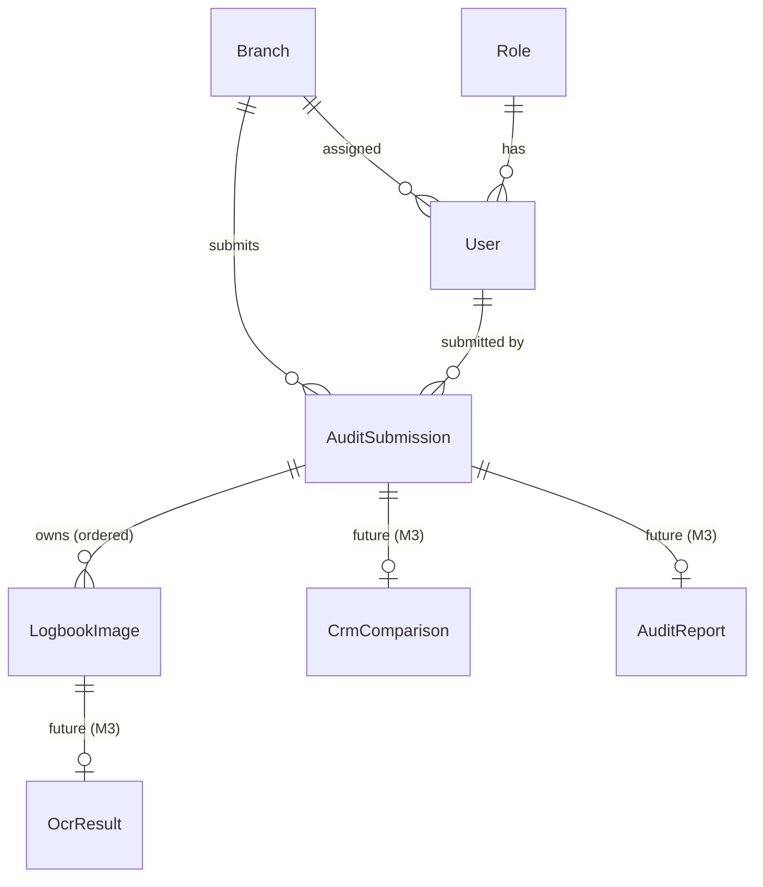
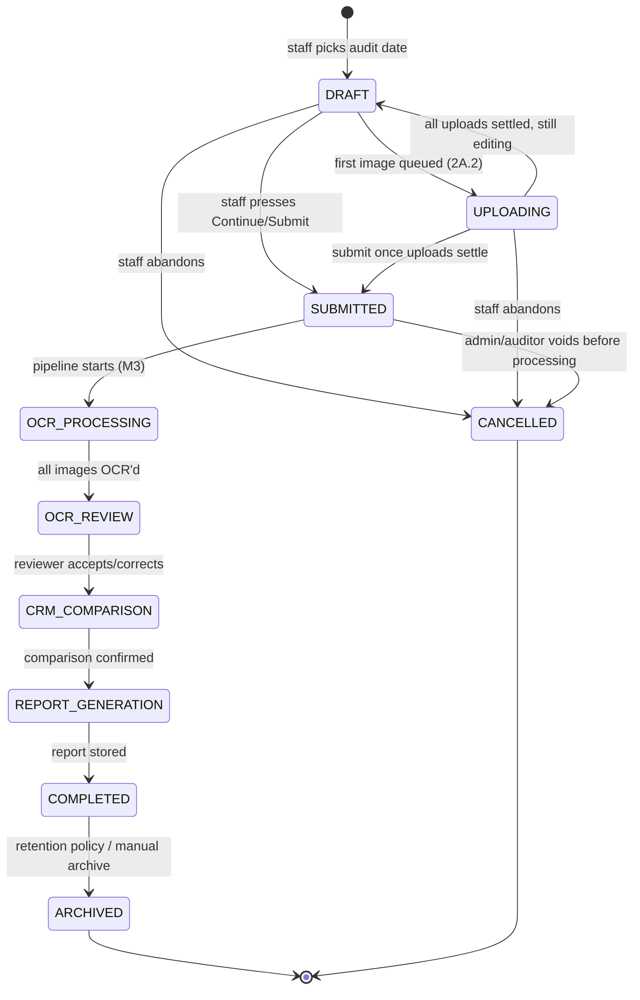
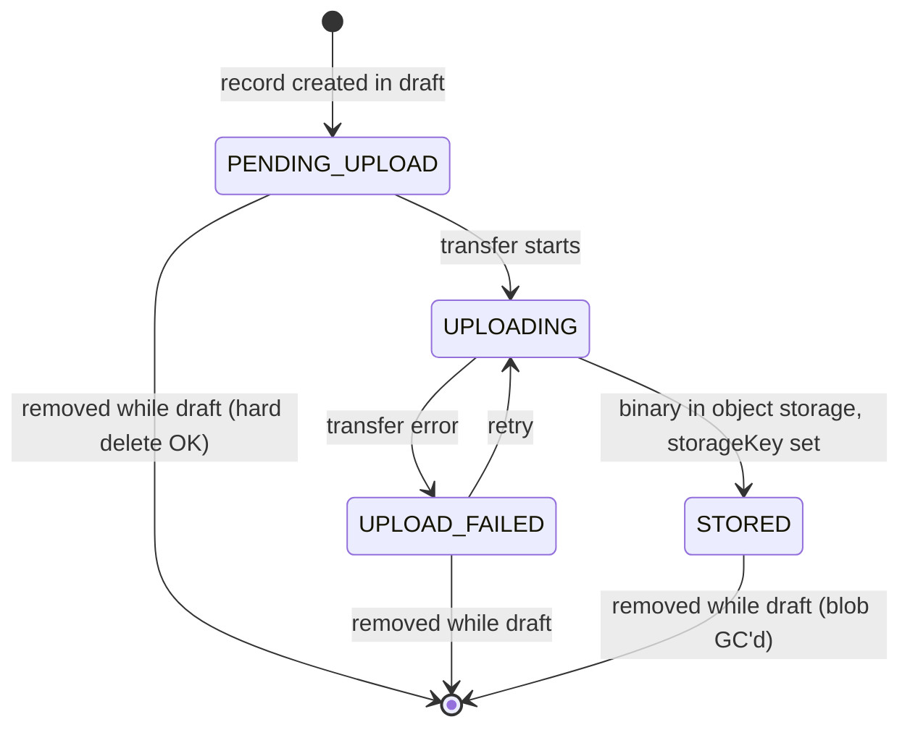
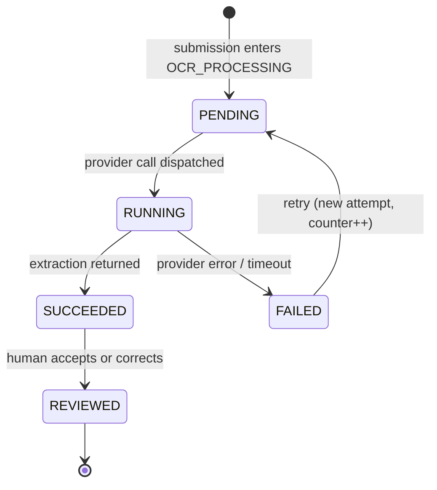
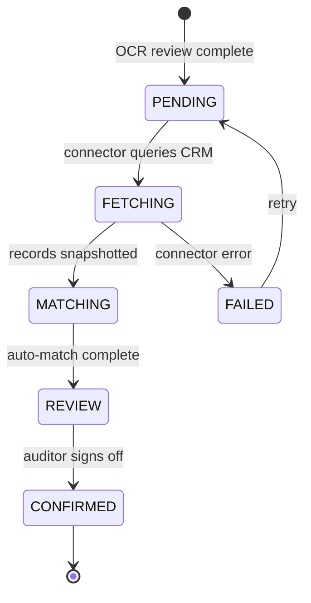

# Domain Model — Audit Module

> **The authoritative business model for the Audit Module.** (Sprint 2A.1.5, ADR-023)
> Code, schema, and UI copy follow this document; if they disagree, this document wins
> and the code is the bug. Changes here require an ADR.
> Related: [DATABASE.md](DATABASE.md) (physical schema) · [ARCHITECTURE.md](ARCHITECTURE.md) · [PRODUCT.md](PRODUCT.md)

## 1. The Business Workflow

What actually happens at a Fermosa branch, and which entity captures each step:

| Step                  | Actor            | Domain meaning                                            |
| --------------------- | ---------------- | --------------------------------------------------------- |
| Login                 | Branch staff     | `User` (role Branch Manager, assigned `Branch`)           |
| Select audit date     | Branch staff     | Creates a **draft `AuditSubmission`** for that date       |
| Upload logbook images | Branch staff     | `LogbookImage`s attached to the submission, in page order |
| Review images         | Branch staff     | Reorder / rotate / remove while the submission is a draft |
| Submit                | Branch staff     | The submission becomes immutable and enters processing    |
| AI reads images       | System           | Future `OcrResult` per image (M3)                         |
| User reviews OCR      | Auditor / staff  | OCR review stage; corrections recorded on `OcrResult`     |
| Compare against CRM   | System + auditor | Future `CrmComparison` on the submission                  |
| Generate audit report | System           | Future `AuditReport`, the submission's final artifact     |

The through-line: **everything hangs off one business act — a branch submitting its
logbook for a specific date.** That act is the aggregate root.

## 2. Aggregate Design

```
┌─ AuditSubmission (ROOT) ────────────────────────────────┐
│  the unit of work, consistency, and status              │
│                                                         │
│   LogbookImage (owned, ordered)                         │
│   OcrResult (future, owned via image)                   │
│   CrmComparison (future, owned)                         │
│   AuditReport (future, owned)                           │
│                                                         │
│   → references Branch, User by ID only                  │
└─────────────────────────────────────────────────────────┘

┌─ Branch (ROOT) ─┐   ┌─ User (ROOT) ─┐   ┌─ SystemSetting (ROOT) ─┐
│  organization    │   │  identity     │   │  configuration          │
└──────────────────┘   └───────────────┘   └──────────────────────────┘
```

**`AuditSubmission` is the root of the audit aggregate** because:

1. It is the _transactional boundary_: images are added/reordered/removed only through
   their submission, and only while it is a draft. Invariants (max 20 images, contiguous
   display order, immutability after submit) are enforced at this boundary.
2. It is the _status carrier_: "where is Tuesday's audit for branch MKT-001?" is a
   question about the submission, never about an individual image.
3. Every future artifact (OCR, comparison, report) exists _because of_ one submission
   and is meaningless outside it.

**Ownership boundaries:**

- `LogbookImage` lives and dies with its submission (`onDelete: Cascade` — true
  ownership). No code path may query or mutate images except through the submission.
- `Branch` and `User` are separate aggregate roots referenced **by ID** with
  `onDelete: Restrict` — a submission is an audit-trail record; the people and places
  it names must not be deletable out from under it (deactivate via status instead,
  per ADR-010).
- Cross-aggregate reactions (dashboard counters, future notifications) go through the
  event bus, not through joins into another aggregate's internals.

**Rejected candidates for the root** (§6 has the naming detail):

- _Upload Batch_ — transport packaging, not a business act; says nothing about audit purpose.
- _Audit Session_ (the M1 model) — implies an auditor's scheduled working period.
  Auditor review is one **stage** of a submission, not the container. M1 modeled it
  auditor-first (`auditorId` required, `scheduledFor`) before the real branch-driven
  workflow was studied.
- _Audit Job_ — machine framing; jobs are how infrastructure processes a submission,
  not what the business tracks or the user sees.

## 3. Entities

### AuditSubmission

One branch's logbook submission for one audit date.

| Field                     | Type        | Notes                                                  |
| ------------------------- | ----------- | ------------------------------------------------------ |
| `id`                      | cuid        | Stable, URL-safe                                       |
| `branchId`                | FK → Branch | `Restrict`; set at creation, never changes             |
| `submittedById`           | FK → User   | `Restrict`; the branch staff member who created it     |
| `auditDate`               | date        | The date the logbook pages cover (not the upload date) |
| `status`                  | enum        | See state machine §5.1                                 |
| `notes`                   | string?     | Free-text remarks by staff/auditor                     |
| `submittedAt`             | datetime?   | Set on DRAFT/UPLOADING → SUBMITTED                     |
| `completedAt`             | datetime?   | Set on → COMPLETED                                     |
| `createdAt` / `updatedAt` | datetime    |                                                        |

Invariants (service-layer enforced):

- Images are mutable **only** in `DRAFT`/`UPLOADING`; from `SUBMITTED` onward the image
  set, order, and rotations are frozen.
- 1–20 images required to submit; `displayOrder` is contiguous starting at 1.
- A Branch Manager can only ever see/create submissions for the assigned branch.
- Multiple submissions per branch+date are _allowed_ (e.g. missed pages discovered
  later) — deliberately no unique constraint; the report stage decides how to treat
  them. Revisit in 2A.2 if the business disagrees.

### LogbookImage

One photographed/scanned logbook page inside a submission.

| Field                     | Type                 | Notes                                                                             |
| ------------------------- | -------------------- | --------------------------------------------------------------------------------- |
| `id`                      | cuid                 | Stable internal ID (never the filename)                                           |
| `submissionId`            | FK → AuditSubmission | `Cascade` — owned                                                                 |
| `displayOrder`            | int                  | 1-based page order; **page number is derived from this**, never stored separately |
| `rotation`                | int                  | 0 / 90 / 180 / 270 — viewing metadata; the stored file is never modified          |
| `originalFileName`        | string               | As uploaded, for user recognition only                                            |
| `storageKey`              | string?              | Object-storage key; **null until 2A.2 stores the file**                           |
| `mimeType`                | string?              |                                                                                   |
| `fileSizeBytes`           | int?                 |                                                                                   |
| `uploadedAt`              | datetime?            | When the binary reached storage (≠ `createdAt`)                                   |
| `status`                  | enum                 | See state machine §5.2                                                            |
| `ocrConfidence`           | float?               | 0..1 — **future** (M3), written by the OCR stage                                  |
| `createdAt` / `updatedAt` | datetime             |                                                                                   |

"Image" vs "Page": the entity is an **image** (a captured artifact — could be blurry,
duplicated, or rotated); "page" is its _position_ in the submission, derived from
`displayOrder`. Storing both invites drift.

### AuditTrailEntry _(shipped in Sprint 2A.2)_

Append-only business-event log inside the submission aggregate: who did what, when.
Actions: `SUBMISSION_CREATED`, `DRAFT_SAVED`, `SUBMISSION_SUBMITTED`, `IMAGE_ADDED`,
`IMAGE_REMOVED`, `IMAGE_REORDERED`. Owned by the submission (`Cascade`); the actor is
referenced with `Restrict` (people behind an audit trail are never deletable).
`metadata` carries IDs/filenames only. Trail rows are the durable _record_; the
in-process event bus carries _notifications_ (ADR-018) — different jobs, deliberately
both.

### AuditFinding _(shipped in Sprint 3.5, ADR-028)_

**The platform's canonical output.** Every producer — rule engine, CRM discovery, OCR,
AI analysis, manual review — creates or updates `AuditFinding` rows; no module invents
its own result format. Owned by the submission aggregate (`Cascade`); never
hard-deleted — a false positive is RESOLVED with a resolution note.

| Field                                      | Notes                                                                                                                                                                                           |
| ------------------------------------------ | ----------------------------------------------------------------------------------------------------------------------------------------------------------------------------------------------- |
| `category`                                 | Closed enum of discrepancy kinds: missing-in-CRM, missing-in-logbook, mismatched field, unmatched/ambiguous patient, missing invoice, record edited/deleted, unreadable entry, duplicate, other |
| `severity`                                 | INFO → CRITICAL; drives queue ordering and dashboard rollups                                                                                                                                    |
| `status`                                   | §5.5 workflow: OPEN → REVIEWED → RESOLVED (reopen allowed)                                                                                                                                      |
| `source`                                   | Which module produced the claim: RULE_ENGINE, CRM_DISCOVERY, OCR, AI_ANALYSIS, MANUAL_REVIEW                                                                                                    |
| `title` / `detail` / `recommendation`      | One-line statement, full explanation, suggested next step                                                                                                                                       |
| `expectedValue` / `actualValue`            | What the authoritative source says vs. what the evidence shows                                                                                                                                  |
| `evidence`                                 | Typed JSON references (`findingEvidenceSchema` in the findings kit): logbook field (image/page/line/field), CRM record, CRM activity event, free note — IDs only, never blobs                   |
| `confidence`                               | 0..1 for machine-produced findings; null for manual                                                                                                                                             |
| `reviewedAt` / `resolvedAt` / `resolution` | Workflow timestamps + closure note                                                                                                                                                              |

### AuditJob / AuditJobStage _(shipped in Sprint 3.6, ADR-029)_

One orchestration run for a submission: the workflow layer's persisted state.
`AuditJob` (status, current stage, who started it) owns five `AuditJobStage` rows —
one per pipeline stage (OCR → HUMAN_REVIEW → CRM_RETRIEVAL → MATCHING → REPORT) with
attempt counters, errors, and waiting reasons. Run statuses
(`QUEUED/RUNNING/WAITING/RETRYING/COMPLETED/FAILED/CANCELLED`) follow a validated
state machine (§5.6); the orchestrator maps active stages onto the submission's §5.1
statuses, which is how submissions now reach `COMPLETED` mechanically. Cancelling a
job never cancels the submission.

#### 5.6: Run status state machine (jobs and stages)



#### 5.5-preview: Finding status workflow



Rules: resolution always passes through review (no OPEN → RESOLVED); findings are
never deleted; reopening is legal from any settled state because audits can be
challenged.

### Future entities — documented now, persisted when their milestone arrives

Per ADR-019 (no empty stubs), these get schema when their feature ships, but their
shape is fixed now so 2A.2/M3 build toward it:

- **`OcrResult`** (M3) — 1:1 with `LogbookImage`. Provider-neutral output of one OCR
  pass: `imageId`, `status` (§5.3), `provider` (AIProviderId), `rawText`,
  `extractedFields` (JSON until the logbook schema is fixed), `confidence`,
  `reviewedById?`, `corrections?` (JSON), attempt counter. Re-runs create new attempts;
  review happens on the latest.
- **`CrmComparison`** (M3) — owned by the submission: `submissionId`, `status` (§5.4),
  `connectorKind`, matched/unmatched counts, `records` (JSON snapshot of what the CRM
  returned — comparisons must be reproducible even after the CRM changes).
- **`AuditReport`** (M3) — 1:1 with the submission: `submissionId`, `generatedAt`,
  `storageKey` (rendered artifact), `summary`. Immutable once generated; regeneration
  supersedes with a new version rather than editing.

## 4. Entity-Relationship Overview



## 5. State Machines

### 5.1 AuditSubmission



Rules:

- **Forward-only after SUBMITTED**, with one exception: a _failed stage_ returns the
  submission to the **preceding reviewable state** (e.g. OCR provider outage:
  `OCR_PROCESSING` → back to `SUBMITTED` with the failure recorded) — failure is a
  recoverable condition on the stage, not a terminal submission state.
- `CANCELLED` is terminal and only reachable **before** `OCR_PROCESSING`; once machine
  work has produced review artifacts, the path forward is completion or archival —
  never silent disappearance (audit-trail sanctity).
- Until 2A.2 exists, the UI's ephemeral batch (ADR-021) corresponds to `DRAFT`/
  `UPLOADING`; the sprint-2A.1 "Continue" button becomes the `→ SUBMITTED` transition.

### 5.2 LogbookImage



- Images are hard-deletable **only while the submission is a draft** — a draft is
  staging, not an audit record. From `SUBMITTED` on, images are frozen and follow the
  submission's lifecycle.
- OCR state deliberately does **not** live on the image: it belongs to `OcrResult`
  (one image can be OCR'd multiple times). The image only carries the denormalized
  `ocrConfidence` of the accepted result, for listing screens.

### 5.3 Future: OCR process (per image, M3)



### 5.4 Future: CRM comparison (per submission, M3)



## 6. Naming Decisions

Reviewed every candidate name; renames only where the old name misrepresents the
business (per the sprint rule):

| Candidate            | Verdict                                  | Reasoning                                                                                                                                                                                        |
| -------------------- | ---------------------------------------- | ------------------------------------------------------------------------------------------------------------------------------------------------------------------------------------------------ |
| **Audit Submission** | ✅ **adopted as root**                   | Names the business act: a branch submits its logbook for a date. Meaningful to staff ("my submission is in review") and auditors alike.                                                          |
| Audit Session (M1)   | ❌ **replaced**                          | A "session" is an auditor's working period. The workflow is branch-initiated; auditor review is a stage, not the container. Keeping it would force every future feature to explain the mismatch. |
| Upload Batch         | ❌ rejected as entity                    | Transport packaging. Lives on only as UI vocabulary for the _draft_ staging step (2A.1's client-side batch).                                                                                     |
| Audit Job            | ❌ rejected                              | Infrastructure framing — a job processes a submission; the business tracks the submission.                                                                                                       |
| **Logbook Image**    | ✅ **adopted** (replaces Logbook Upload) | "Upload" names a transfer event, not the thing itself. After the transfer finishes, the business still talks about the image.                                                                    |
| Image vs Page        | Image is the entity                      | "Page" = derived position (`displayOrder`). Storing both invites drift.                                                                                                                          |
| OCR Result           | ✅ kept (future)                         | Accurate and provider-neutral; per image, per attempt.                                                                                                                                           |
| Audit Report         | ✅ kept (future)                         | The workflow's final artifact; no better name proposed.                                                                                                                                          |

## 7. Glossary

| Term                          | Meaning                                                                                          |
| ----------------------------- | ------------------------------------------------------------------------------------------------ |
| **Audit Submission**          | One branch's logbook submission for one audit date — the aggregate root of the audit workflow    |
| **Audit Date**                | The calendar date the logbook pages cover (not the day they were uploaded)                       |
| **Logbook Image**             | One photographed/scanned logbook page inside a submission                                        |
| **Page number**               | An image's 1-based position (`displayOrder`) within its submission — derived, never stored twice |
| **Draft**                     | A submission still being assembled; images freely editable; not yet an audit record              |
| **Submit**                    | The irreversible act that freezes a submission's images and enters it into processing            |
| **OCR Result** _(future)_     | Provider-neutral output of one OCR attempt on one image, including human corrections             |
| **CRM Comparison** _(future)_ | The reproducible match of a submission's extracted data against snapshotted CRM records          |
| **Audit Report** _(future)_   | The immutable final artifact generated for a completed submission                                |
| **Archive**                   | Post-completion retention state; read-only, kept for compliance                                  |

## 8. Risks & Open Questions Before Sprint 2A.2

1. ~~**Draft persistence timing**~~ — **Resolved in Sprint 2A.2 (ADR-025):** drafts
   persist on first _save_ (Save draft / Submit), not first keystroke. New submissions
   stage client-side; reopened drafts are fully server-backed. Images register with the
   server at upload time (stable id born there), so `PENDING_UPLOAD` exists only
   transiently inside the upload action.
2. **Multiple submissions per branch+date** are currently allowed (§3). If the business
   expects exactly one, add the unique constraint _before_ data exists.
3. **Upload atomicity** — 20 × 10 MB over branch connections will see partial failures;
   the `UPLOAD_FAILED → UPLOADING` retry loop must surface in the 2A.1 card UI (slot
   already reserved).
4. **Rotation semantics** — rotation is viewing metadata; decide in M3 whether OCR
   consumes the rotated orientation (recommended) or raw + rotation hint.
5. **`extractedFields` as JSON** is a placeholder until the real logbook page schema is
   specified with the business — the single biggest unknown in the model. Getting a
   sample logbook page before M3 would de-risk it substantially.
6. **Retention policy** for `ARCHIVED` (and blob storage costs) has no owner yet.
